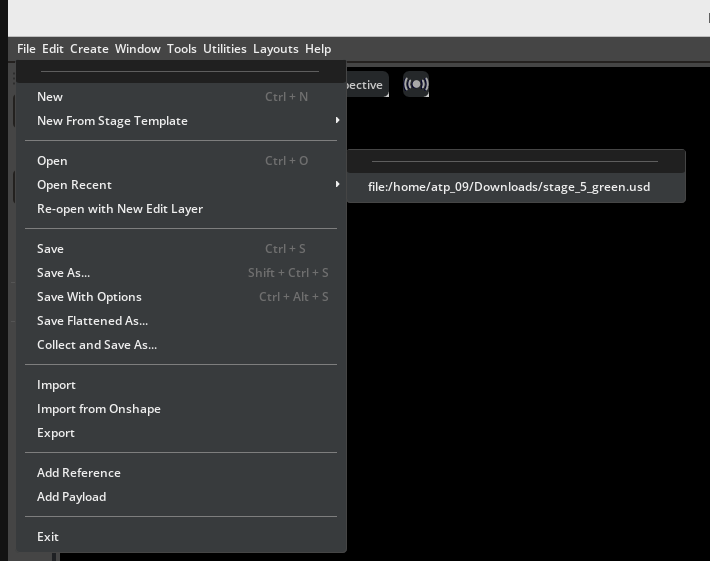
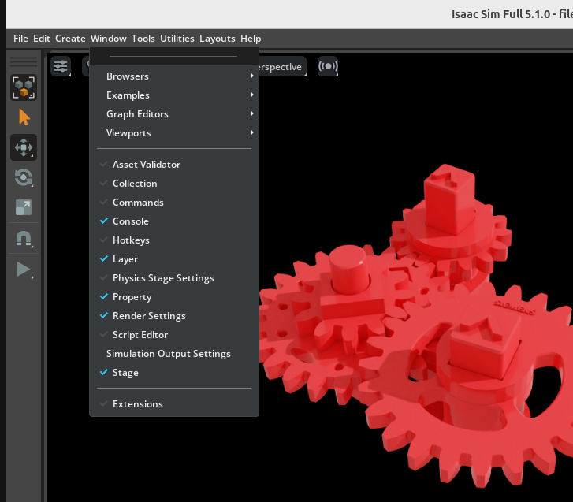
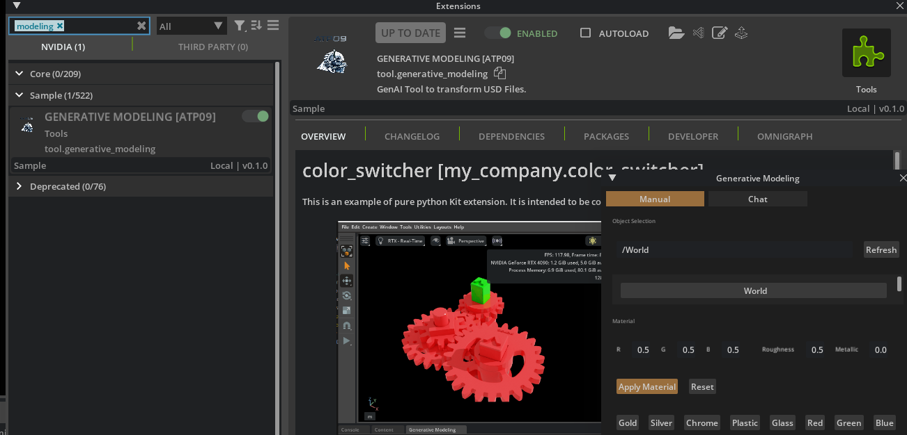
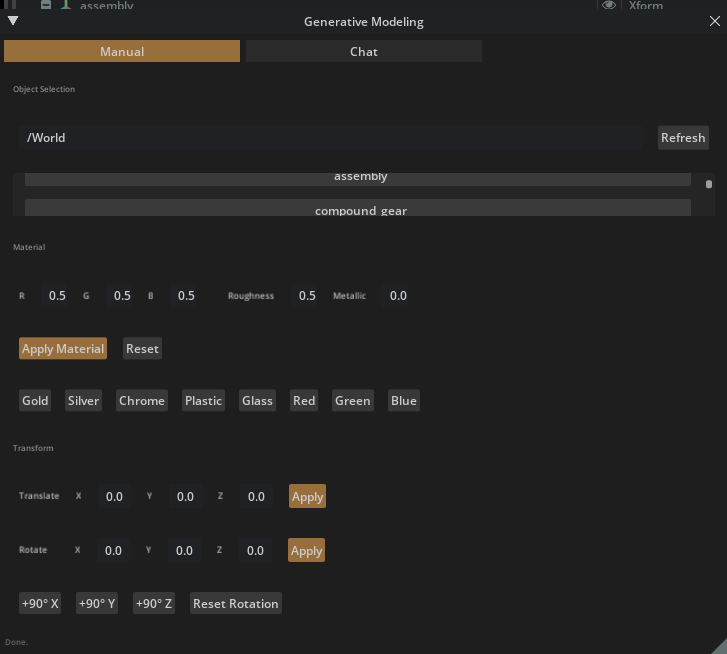
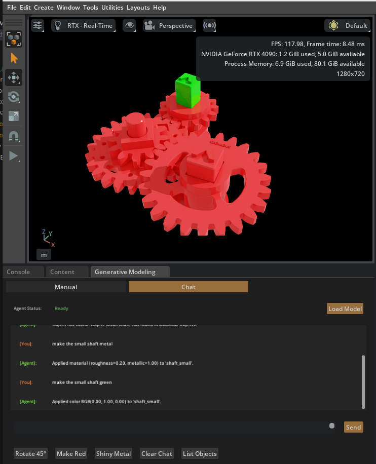
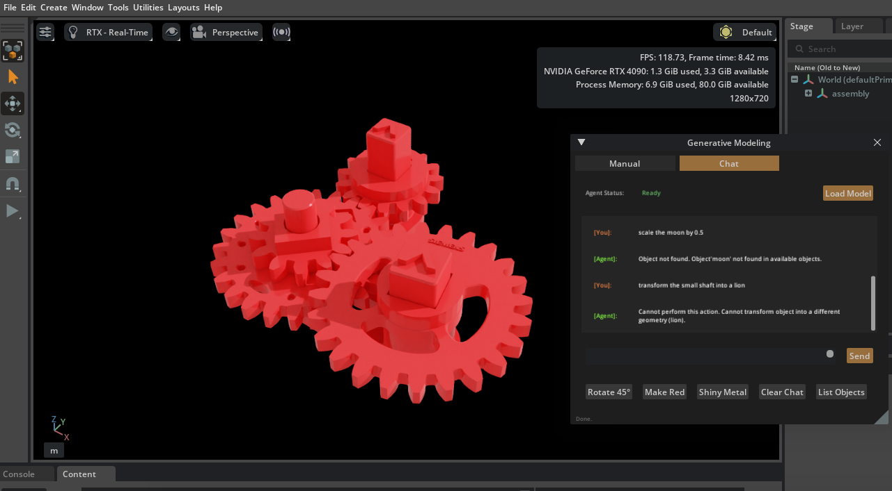

# Generative Modeling Extension for Isaac Sim

A powerful Isaac Sim extension that combines **manual USD manipulation** with **LLM-powered natural language commands** for intuitive 3D scene editing.

---

## Features

### Manual Mode
- **Object Selection**: Browse and select individual mesh objects from your USD scene
- **Material Editing**: Apply colors (RGB), adjust roughness and metallic properties
- **Transformations**: Translate objects along X/Y/Z axes, rotate by custom angles
- **Real-time Updates**: Changes are applied instantly to your 3D scene

### Chat Mode (LLM-Powered)
- **Natural Language Commands**: Control your scene using plain text instructions
- **Intelligent Parsing**: The LLM understands context and object references
- **Feedback System**: Receive explanations when requests cannot be fulfilled
- **Multi-Action Support**: Combine multiple operations in a single command

---

## How to Use

### Step 1: Open Your USD File

First, load your USD scene file in Isaac Sim.

1. Go to **File → Open**
2. Navigate to your USD file and open it



---

### Step 2: Open the Extensions Window

1. Go to **Window → Extensions**



---

### Step 3: Enable the Extension

1. In the Extensions window, search for **"Generative Modeling"** or **"tool.generative_modeling"**
2. Click the **toggle switch** to enable the extension
3. The extension window will appear automatically



---

### Step 4: Using Manual Mode

The **Manual** tab provides direct control over your scene objects.



#### Object Selection
1. Click **"Refresh"** to load all mesh objects from your scene
2. **Important**: Always refresh after loading a new model!
3. Select an object by clicking on it in the scrollable list

#### Material Settings
- **R / G / B**: Set the color values (0.0 to 1.0)
- **Roughness**: Adjust surface roughness (0.0 = smooth/shiny, 1.0 = rough/matte)
- **Metallic**: Set metallic appearance (0.0 = non-metal, 1.0 = full metal)
- Click **"Apply Material"** to apply your settings

#### Transformations
- **X / Y / Z**: Enter translation values in scene units
- Click **"Translate"** to move the selected object
- Enter a rotation angle and click **"Rotate 45°"** (or your custom angle)

#### Utility
- **"List Objects"**: Print all scene objects to the console for debugging

---

### Step 5: Using Chat Mode (LLM)

The **Chat** tab allows you to control your scene using natural language.



#### Loading the Model
1. Switch to the **Chat** tab
2. Click **"Load Model"** and wait for the LLM to initialize
3. The status will change to **"Ready"** when the model is loaded

#### Sending Commands
1. Type your instruction in the text field
2. Click **"Send"** or press Enter
3. The LLM will interpret your command and execute the appropriate actions

#### Example Commands

**Material Changes:**
```
Make the small shaft green
Set the gear to a golden metallic color
Make the base plate red with high roughness
```

**Rotations:**
```
Rotate the small shaft along the X axis by 30 degrees
Tilt the gear 45 degrees around the Y axis
```

**Translations:**
```
Move the shaft up by 10 units
Translate the base 5 units to the right
```

**Combined Commands:**
```
Make the shaft blue and rotate it 90 degrees around Z
```

---

### Step 6: Understanding LLM Feedback

The LLM provides helpful feedback when it cannot fulfill a request:



**Common Feedback Scenarios:**
- **Object not found**: The LLM will tell you if it cannot identify the referenced object
- **Invalid parameters**: You'll receive guidance on correct value ranges
- **Unsupported operations**: The LLM explains what operations are available

---

## Tips & Best Practices

1. **Always Refresh First**: After loading a new USD file, click "Refresh" in Manual mode to populate the object list

2. **Use Descriptive Names**: The LLM works best when your USD objects have meaningful names (e.g., "small_shaft", "main_gear")

3. **Check the Console**: Debug information and operation results are printed to the Isaac Sim console

4. **Start Simple**: Begin with single operations before combining multiple commands

5. **Color Values**: RGB values range from 0.0 to 1.0 (not 0-255)

---

## Troubleshooting

| Problem | Solution |
|---------|----------|
| No objects in list | Click "Refresh" after loading your USD file |
| LLM not responding | Ensure the model is loaded (status shows "Ready") |
| Material not visible | Check that your object has a valid mesh |
| Extension not found | Verify the extension path in Isaac Sim settings |

---

## Technical Requirements

- **Isaac Sim**: Version 5.1.0 or compatible
- **Python**: 3.11 (embedded in Isaac Sim)
- **GPU**: CUDA-capable GPU for LLM inference
- **Dependencies**: pydantic, transformers, langgraph, pyyaml

---

## Support

For issues or feature requests, please check the console output for detailed error messages and debugging information.
