# Generative Modeling Extension for Isaac Sim

A powerful Isaac Sim extension that combines **manual USD manipulation** with **LLM-powered natural language commands** for intuitive 3D scene editing.

---

## Features

### Manual Mode
- **Object Selection**: Browse and select individual mesh objects from your USD scene
- **Material Editing**: Apply colors (RGB), adjust roughness and metallic properties
- **Transformations**: Translate objects along X/Y/Z axes, rotate by custom angles
- **Real-time Updates**: Changes are applied instantly to your 3D scene

### Chat Mode (LLM-Powered)
- **Natural Language Commands**: Control your scene using plain text instructions
- **Intelligent Parsing**: The LLM understands context and object references
- **Feedback System**: Receive explanations when requests cannot be fulfilled
- **Multi-Action Support**: Combine multiple operations in a single command

---

## How to Use

### Step 1: Open Your USD File

First, load your USD scene file in Isaac Sim.

1. Go to **File → Open**
2. Navigate to your USD file and open it


---

### Step 2: Open the Extensions Window

1. Go to **Window → Extensions**


---

### Step 3: Enable the Extension

1. In the Extensions window, search for **"Generative Modeling"** or **"tool.generative_modeling"**
2. Click the **toggle switch** to enable the extension
3. The extension window will appear automatically


---

### Step 4: Using Manual Mode

The **Manual** tab provides direct control over your scene objects.


#### Object Selection
1. Click **"Refresh"** to load all mesh objects from your scene
2. **Important**: Always refresh after loading a new model!
3. Select an object by clicking on it in the scrollable list

#### Material Settings
- **R / G / B**: Set the color values (0.0 to 1.0)
- **Roughness**: Adjust surface roughness (0.0 = smooth/shiny, 1.0 = rough/matte)
- **Metallic**: Set metallic appearance (0.0 = non-metal, 1.0 = full metal)
- Click **"Apply Material"** to apply your settings

#### Transformations
- **X / Y / Z**: Enter translation values in scene units
- Click **"Translate"** to move the selected object
- Enter a rotation angle and click **"Rotate 45°"** (or your custom angle)

#### Utility
- **"List Objects"**: Print all scene objects to the console for debugging

---

### Step 5: Using Chat Mode (LLM)

The **Chat** tab allows you to control your scene using natural language.


#### Loading the Model
1. Switch to the **Chat** tab
2. Click **"Load Model"** and wait for the LLM to initialize
3. The status will change to **"Ready"** when the model is loaded

#### Sending Commands
1. Type your instruction in the text field
2. Click **"Send"** or press Enter
3. The LLM will interpret your command and execute the appropriate actions

#### Example Commands

**Material Changes:**
```
Make the small shaft green
Set the gear to a golden metallic color
Make the base plate red with high roughness
```

**Rotations:**
```
Rotate the small shaft along the X axis by 30 degrees
Tilt the gear 45 degrees around the Y axis
```

**Translations:**
```
Move the shaft up by 10 units
Translate the base 5 units to the right
```

**Combined Commands:**
```
Make the shaft blue and rotate it 90 degrees around Z
```

---

### Step 6: Understanding LLM Feedback

The LLM provides helpful feedback when it cannot fulfill a request:


**Common Feedback Scenarios:**
- **Object not found**: The LLM will tell you if it cannot identify the referenced object
- **Invalid parameters**: You'll receive guidance on correct value ranges
- **Unsupported operations**: The LLM explains what operations are available

---

## Example Usage: Transforming a Scene with LLM Commands

This walkthrough demonstrates how to transform a 3D gear assembly using only natural language commands.

### Step 0: Base Scene

Starting with the original USD scene - an unmodified gear assembly.

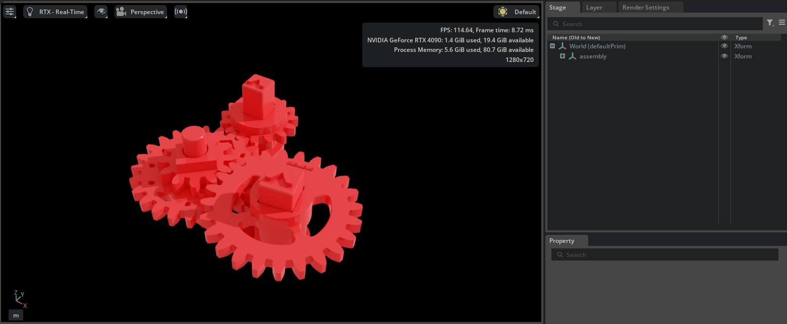

---

### Step 1: Change the Material of the Big Gear

**Command:** *"Make the big gear gold"*

The LLM identifies the large gear and applies a golden metallic material.

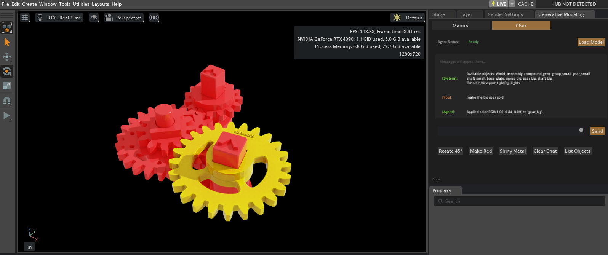

---

### Step 2: Move the Big Gear

**Command:** *"Move the big gear 10 units on the x and y axis"*

The gear is translated along the X-axis.

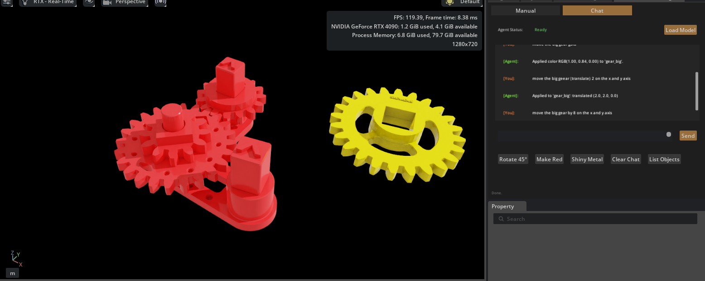

---

### Step 3: Rotate the White Shaft

**Command:** *"Make the shaft white and rotate it by 45 degree along the y axis"*

The central shaft receives a clean white material.

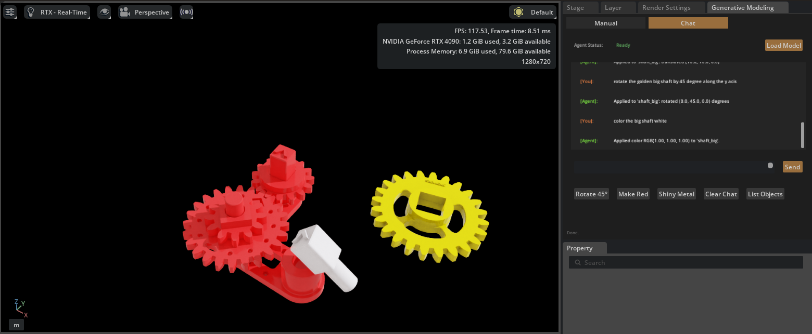

---

### Step 4: Blue Base Plate

**Command:** *"Color the base plate blue"*

The base plate is transformed to a vibrant blue color.

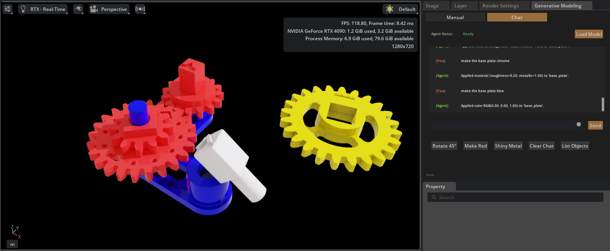

---

### Step 5: Move White Small Gear

**Command:** *"Make the small gear white & move it up by 5"*

The smaller gear is updated to match the shaft's white appearance.

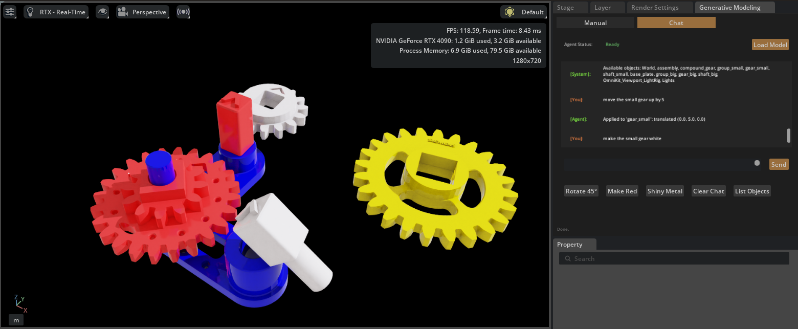

---

### Step 6: Memory & Compound Commands

**Command:** *"Lift the Compund Gear by 5 Units"*

The LLM remembers previous transformations and can apply consistent styling across objects.

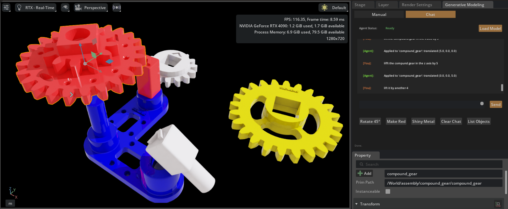

---

### Final Result

The scene has been completely transformed using only natural language commands - no manual parameter adjustments required!

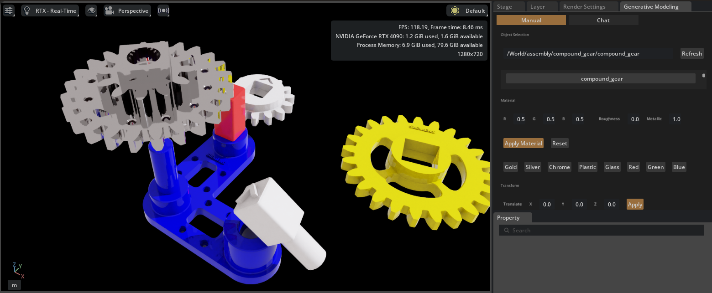

---

## Tips & Best Practices

1. **Always Refresh First**: After loading a new USD file, click "Refresh" in Manual mode to populate the object list

2. **Use Descriptive Names**: The LLM works best when your USD objects have meaningful names (e.g., "small_shaft", "main_gear")

3. **Check the Console**: Debug information and operation results are printed to the Isaac Sim console

4. **Start Simple**: Begin with single operations before combining multiple commands

5. **Color Values**: RGB values range from 0.0 to 1.0 (not 0-255)

---

## Troubleshooting

| Problem | Solution |
|---------|----------|
| No objects in list | Click "Refresh" after loading your USD file |
| LLM not responding | Ensure the model is loaded (status shows "Ready") |
| Material not visible | Check that your object has a valid mesh |
| Extension not found | Verify the extension path in Isaac Sim settings |

---

## Model Analysis

We evaluated multiple open-source LLMs to find the best model for our agent pipeline. The benchmark tests 10 different scenarios including valid transformations (rotate, zoom), invalid operations (flip, mirror, move), unknown objects, and ambiguous requests.

### Benchmark Results

| Model | Accuracy | Avg. Inference Time | Load Time |
|-------|----------|---------------------|-----------|
| **GPT-OSS-20B** | **100%** | 5.88s | 3.47s |
| Qwen2.5-7B | 90% | 1.04s | 2.35s |
| Mistral-7B | 80% | 1.73s | 2.19s |
| Phi-3-Mini | 80% | 1.01s | 1.58s |

### Accuracy Comparison

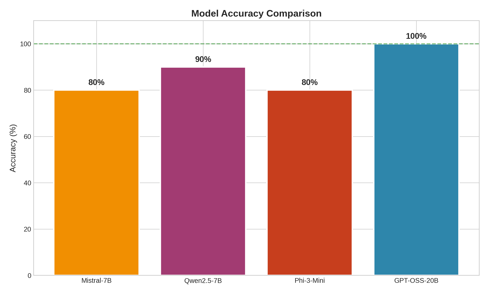

### Inference Time Comparison

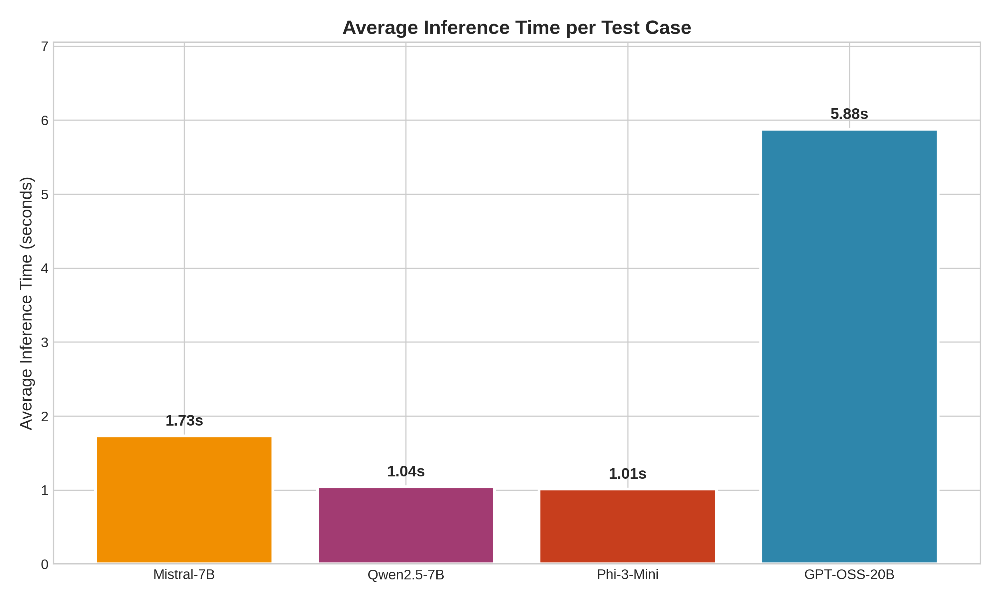

### Accuracy vs. Speed Trade-off

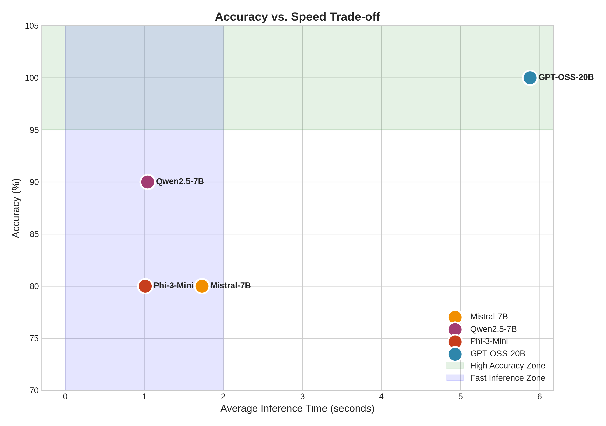

### Test Results per Model

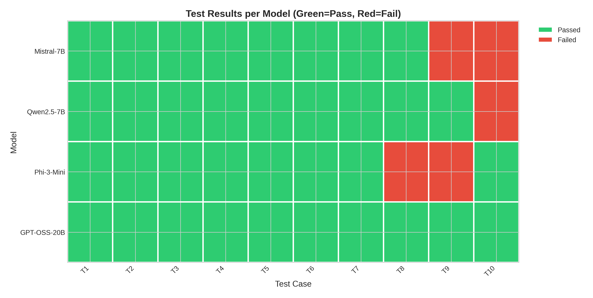

### Performance by Test Category

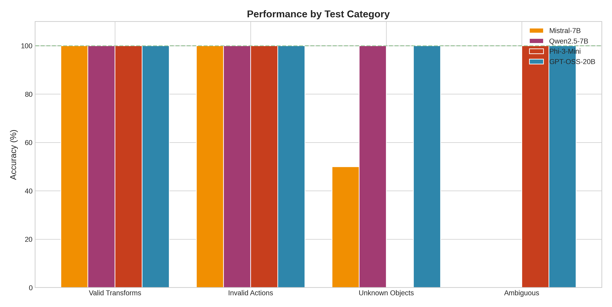

### Benchmark Dashboard

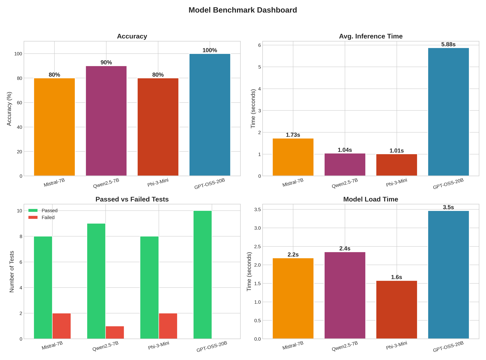

### Model Selection: GPT-OSS-20B

After extensive benchmarking, we selected **openai/gpt-oss-20b** as our default model for the following reasons:

1. **100% Accuracy**: The model correctly handles all test cases, including edge cases like ambiguous requests and invalid transformations. This is critical for our use case where every user command must be interpreted correctly.

2. **Reliability over Speed**: While models like Qwen2.5-7B (1.04s) and Phi-3-Mini (1.01s) offer significantly faster inference times, their 90% and 80% accuracy rates mean that 1-2 out of every 10 commands could be misinterpreted or fail.

3. **Acceptable Latency**: The ~5.9 second average inference time, while slower than alternatives, remains within an acceptable range for interactive 3D scene manipulation. Users typically need time to observe the result of one transformation before issuing the next command.

4. **Correctness is Critical**: In a 3D modeling context, incorrect transformations can be difficult to undo or may go unnoticed, leading to accumulated errors. We prioritize **correct interpretation of every command** over raw speed.

> **Conclusion**: For production use, we recommend GPT-OSS-20B. For rapid prototyping or testing where occasional errors are acceptable, Qwen2.5-7B offers an excellent speed/accuracy trade-off.

---

## Technical Requirements

- **Isaac Sim**: Version 5.1.0 or compatible
- **Python**: 3.11 (embedded in Isaac Sim)
- **GPU**: CUDA-capable GPU for LLM inference
- **Dependencies**: pydantic, transformers, langgraph, pyyaml

---

## Support

For issues or feature requests, please check the console output for detailed error messages and debugging information.
